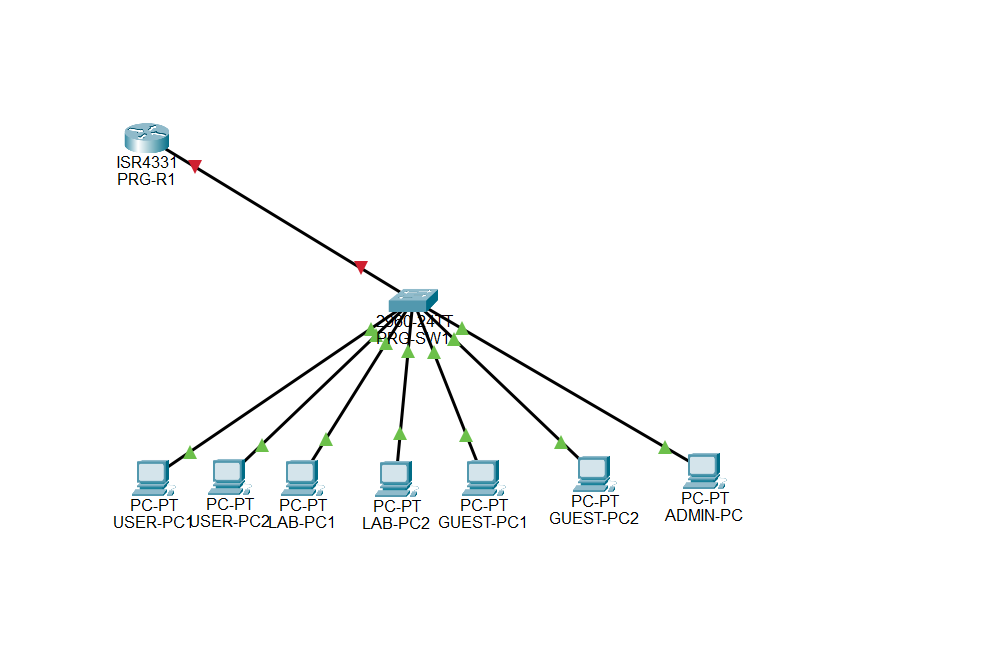
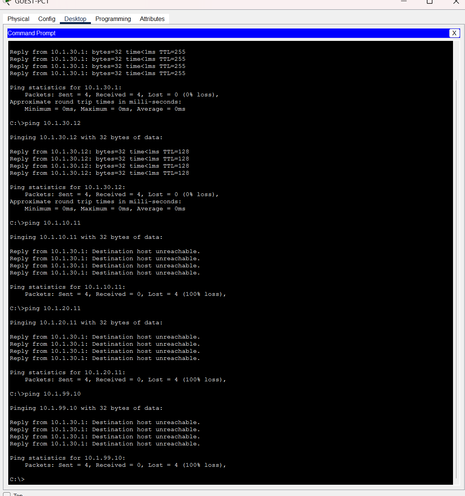
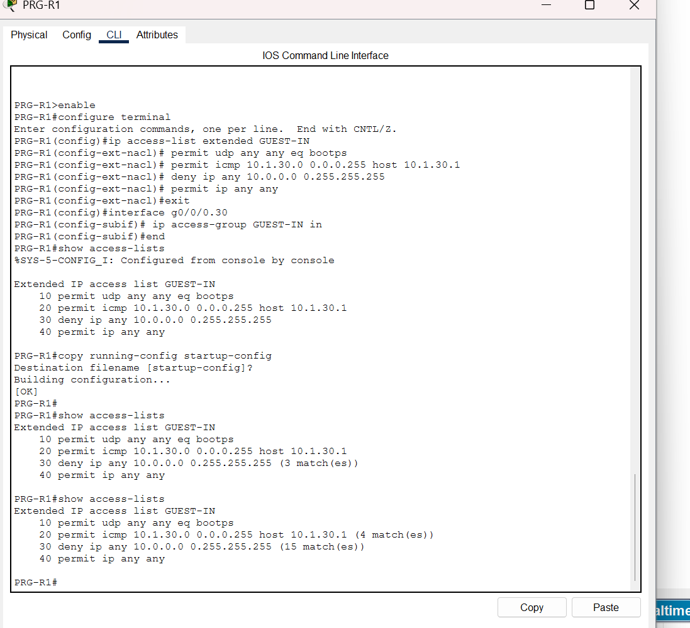
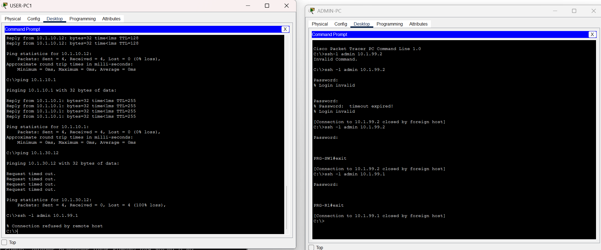
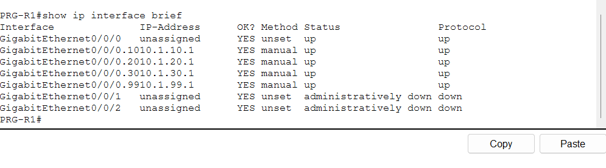

# Vitalis Pharma — Prague HQ Network

A campus network for the Prague headquarters of a fictional pharmaceutical company, designed, built and tested in **Cisco Packet Tracer 9.0.1**.

The project covers the typical work of a junior network engineer: planning VLANs and IP addressing with room for growth, configuring routing, DHCP and access control, securing device management, testing against a written plan, and documenting the result.

> *Vitalis Pharma s.r.o.* is fictional. All passwords in this lab (`Lab@2026`) are lab-only placeholders.



## Requirements

| # | Requirement | How it is met |
|---|-------------|---------------|
| R1 | Separate employees, laboratory equipment, guests and network management | 4 VLANs on the access switch |
| R2 | Departments must be able to communicate where needed | Inter-VLAN routing on the router (router-on-a-stick) |
| R3 | End devices get addresses automatically; infrastructure keeps fixed addresses | DHCP on the router for USERS/LAB/GUEST, static addressing for MGMT |
| R4 | Guests must not reach any internal network | Extended ACL `GUEST-IN` on the guest subinterface |
| R5 | Devices are managed remotely, encrypted, and only from the management network | SSH v2 + `access-class` on all VTY lines |
| R6 | Room for growth without reconfiguration | Pre-assigned port ranges per VLAN, /24 per VLAN |

## Design

### Devices

| Hostname | Model | Role |
|----------|-------|------|
| PRG-R1 | Cisco ISR 4331 | Default gateway for all VLANs, DHCP server, ACL enforcement |
| PRG-SW1 | Cisco Catalyst 2960-24TT | Access switch, VLAN segmentation |
| USER-PC1/2, LAB-PC1/2, GUEST-PC1/2, ADMIN-PC | PC | End devices |

### VLANs and IP addressing

The third octet of every subnet matches the VLAN ID, so an address immediately tells which segment it belongs to.

| VLAN | Name | Subnet | Gateway | Addressing | Switch ports |
|------|------|--------|---------|------------|--------------|
| 10 | USERS | 10.1.10.0/24 | 10.1.10.1 | DHCP (.11–.254) | Fa0/1–10 |
| 20 | LAB | 10.1.20.0/24 | 10.1.20.1 | DHCP (.11–.254) | Fa0/11–20 |
| 30 | GUEST | 10.1.30.0/24 | 10.1.30.1 | DHCP (.11–.254) | Fa0/21–23 |
| 99 | MGMT | 10.1.99.0/24 | 10.1.99.1 | Static | Fa0/24 |

Addresses `.1–.10` in every subnet are excluded from DHCP and reserved for gateways, printers and other infrastructure.

**Static addresses**

| Device | Interface | Address |
|--------|-----------|---------|
| PRG-R1 | Gi0/0/0.10 / .20 / .30 / .99 | 10.1.10.1 / 10.1.20.1 / 10.1.30.1 / 10.1.99.1 |
| PRG-SW1 | Vlan99 (SVI) | 10.1.99.2 |
| ADMIN-PC | Fa0 | 10.1.99.10 |

### Physical connections

| Device | Port | PRG-SW1 port | Mode |
|--------|------|--------------|------|
| PRG-R1 | Gi0/0/0 | Gi0/1 | 802.1Q trunk |
| USER-PC1 / USER-PC2 | Fa0 | Fa0/1 / Fa0/2 | access, VLAN 10 |
| LAB-PC1 / LAB-PC2 | Fa0 | Fa0/11 / Fa0/12 | access, VLAN 20 |
| GUEST-PC1 / GUEST-PC2 | Fa0 | Fa0/21 / Fa0/22 | access, VLAN 30 |
| ADMIN-PC | Fa0 | Fa0/24 | access, VLAN 99 |

## Design decisions

**Router-on-a-stick for inter-VLAN routing.** A single trunk carries all four VLANs to the router, where one subinterface per VLAN acts as that VLAN's default gateway. It is the simplest design for a single small site and makes every inter-VLAN flow pass through one point where it can be filtered. For a larger site, a Layer 3 switch would remove the single link as a bottleneck.

**/24 per VLAN.** Each VLAN has far more addresses than it needs (254 hosts for 2 PCs). Address space in `10.0.0.0/8` is not scarce here, and a uniform /24 with VLAN ID = third octet makes the plan easy to read and troubleshoot. See the subnetting exercise below for a tighter alternative.

**Port ranges with spare capacity.** Ports are assigned to VLANs in blocks (1–10, 11–20, 21–23, 24), not one by one. A new employee can be plugged into any free port in the range without a configuration change.

**Separate LAB VLAN.** Laboratory and manufacturing equipment in the pharmaceutical industry is often validated and rarely patched, so it is kept in its own segment, away from general user traffic.

## Security

### Guest isolation — `GUEST-IN`

Applied inbound on `Gi0/0/0.30`, so guest traffic is checked as soon as it enters the router.

Comments after `!` are explanations for this README and are not part of the device config.

```
ip access-list extended GUEST-IN
 10 permit udp any any eq bootps                     ! DHCP still works (incl. unicast renewals to 10.1.30.1)
 20 permit icmp 10.1.30.0 0.0.0.255 host 10.1.30.1   ! guests may ping their own gateway for troubleshooting
 30 deny   ip any 10.0.0.0 0.255.255.255             ! no access to any internal network, current or future
 40 permit ip any any                                ! everything else (Internet) is allowed
```

- Denying the whole `10.0.0.0/8` instead of each subnet means new sites or VLANs are blocked automatically.
- Traffic between two guests stays inside VLAN 30 on the switch and never reaches the ACL.
- The ACL is stateless: when an employee pings a guest, the request arrives but the guest's reply is dropped by rule 30. A stateful firewall would be needed to allow internal-to-guest sessions while keeping guests out.

### Device management — SSH from MGMT only

On both PRG-R1 and PRG-SW1:

- SSH version 2 with a 1024-bit RSA key; Telnet is disabled (`transport input ssh`)
- local user `admin` and `enable secret`, both stored as hashes
- `access-class 10 in` on **all** VTY lines: `access-list 10` permits only `10.1.99.0/24`

This protects the management plane only. A user PC can still ping 10.1.99.1, but cannot log in to it.

## Testing

All 23 tests in the [test plan](docs/test-plan.md) pass. Highlights:

| Test | Result |
|------|--------|
| USER → LAB / GUEST / MGMT ping (before ACL) | ✅ inter-VLAN routing works |
| GUEST → own gateway and other guest | ✅ allowed |
| GUEST → USERS / LAB / MGMT | ✅ blocked, `Destination host unreachable` |
| ADMIN-PC → SSH to switch and router | ✅ `PRG-SW1#`, `PRG-R1#` |
| USER-PC1 → SSH to router | ✅ `Connection refused by remote host` |

| Guest isolation | ACL hit counters |
|---|---|
|  |  |

| SSH from ADMIN-PC vs USER-PC1 | Router interfaces |
|---|---|
|  |  |

## Lessons learned

**Troubleshooting step by step.** A ping from USERS to a LAB PC failed while other VLANs worked. Pinging the LAB gateway succeeded, which ruled out the router, the trunk and VLAN 20 and narrowed the fault down to the end device: the LAB PCs had never been switched to DHCP. Full log in the [test plan](docs/test-plan.md#troubleshooting-log).

**Review the configuration after applying it.** Reading the exported switch config showed that only `line vty 0 4` was secured. The 2960 has 16 VTY lines, not 5 like the router, so `vty 5 15` had no `access-class` and no SSH-only restriction. This was fixed with `line vty 0 15`.

**Simulator limits.** Packet Tracer does not support some IOS commands (`terminal length 0`, `show running-config interface`), and `crypto key generate rsa` did not prompt for a key size. Configurations were exported from the device's *Config → Settings* tab instead.

## Subnetting exercise

If address space were limited to a single `10.1.0.0/24` and the site grew to the headcounts below, the VLANs could be sized like this:

| VLAN | Hosts needed | Prefix | Usable hosts | Subnet |
|------|--------------|--------|--------------|--------|
| 10 USERS | 120 | /25 | 126 | 10.1.0.0/25 |
| 20 LAB | 40 | /26 | 62 | 10.1.0.128/26 |
| 30 GUEST | 25 | /27 | 30 | 10.1.0.192/27 |
| 99 MGMT | 10 | /28 | 14 | 10.1.0.224/28 |

Usable hosts = 2^(32 − prefix) − 2. Subnets are allocated largest first so that each one starts on a valid boundary.

## Possible improvements for production

- Shut down or park unused switch ports in an unused VLAN (trade-off with the plug-and-work growth design)
- Console password and `exec-timeout` on all lines
- Stronger password hashing (type 8/9) instead of MD5 (type 5)
- Stateful firewall for guest and lab segments; Internet access via NAT
- Port security / 802.1X on access ports, DHCP snooping
- Second router or Layer 3 switch for redundancy (HSRP)
- Expansion to branch offices with dynamic routing (OSPF)

## Repository structure

```
├── vitalis-prague-hq.pkt     Packet Tracer project file
├── configs/                  Exported running-configs of PRG-R1 and PRG-SW1
├── docs/test-plan.md         Test plan, results and troubleshooting log
└── images/                   Topology and test screenshots
```

## How to open

1. Install [Cisco Packet Tracer](https://www.netacad.com/cisco-packet-tracer) 8.2 or newer.
2. Open `vitalis-prague-hq.pkt`.
3. Credentials on all network devices: user `admin`, password `Lab@2026` (also the enable secret).

## Author

**Shon Karim** — Informatics student, Czech University of Life Sciences Prague
